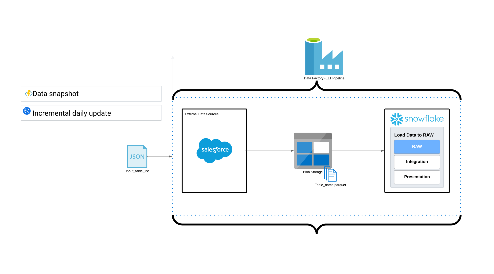

# Salesforce to Snowflake Data ELT Pipeline
This project demonstrates building an end-to-end ELT pipeline using Azure Data Factory to transfer data from Salesforce to Snowflake. It involves reading table names from an Excel file, copying data to Parquet files in Azure Blob Storage, and then loading and transforming these files into Snowflake tables using a stored procedure.

### Prerequisites
- API permissions must be enabled in Salesforce.

- Azure Data Factory and Resource group access.

- Azure Key Vault (recommended for production systems).

### Architecture Overview

